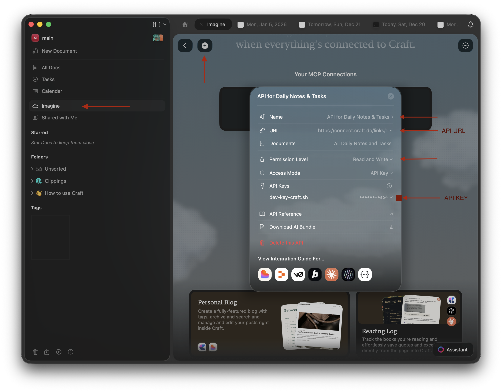

# craft.sh

Command-line tool for quick capture to Craft Documents. Never leave your terminal to capture thoughts, code snippets, or command output.

`craft.sh` is a lightweight bash script that streams text directly to your Craft daily notes. Pipe command output, capture error logs, or save code snippets—all without breaking your flow.

## Requirements

- **curl** - API requests
- **jq** - JSON processing
- **Craft API key and URL** - From Craft Imagine section
- **git** - (optional) to clone the repository

**Install dependencies:**
```bash
# macOS (comes with curl preinstalled)
brew install jq

# Ubuntu/Debian
sudo apt-get install curl jq
```

## Installation

**Option 1: Homebrew (macOS)**
```bash
brew tap gdamberg/craft.sh https://github.com/gdamberg/craft.sh
brew install craft-sh
```

**Option 2: Download the latest release**
```bash
curl -fsSL https://github.com/gdamberg/craft.sh/releases/latest/download/craft.sh \
  -o craft.sh
chmod +x craft.sh

# Optional: install system-wide
sudo mv craft.sh /usr/local/bin/
```

**Option 3: Clone the repository**
```bash
git clone https://github.com/gdamberg/craft.sh.git
cd craft.sh
chmod +x craft.sh

# Optional: install system-wide
sudo cp craft.sh /usr/local/bin/
```

**Configure API credentials:**

Get your Craft API Key and URL from within Craft under ☁️ Imagine.



> **Keep your credentials secret.** The API key and URL give read/write access to your personal Craft space and should not be shared.

```bash
# Option 1: Config file (~/.config/craft.sh/config)
mkdir -p ~/.config/craft.sh
cat > ~/.config/craft.sh/config <<'EOF'
CRAFT_API_KEY="your-api-key-here"
CRAFT_API_URL="your-api-url-here"
EOF
chmod 600 ~/.config/craft.sh/config

# Option 2: Environment variables
export CRAFT_API_KEY="your-api-key-here"
export CRAFT_API_URL="your-api-url-here"
```

_Environment variables take precedence over the config file._

**Verify your installation:**

```bash
craft.sh 'Hello from `craft.sh`'
```

The script should exit silently and the message should appear in today's note in Craft.

## Usage

> **Note:** The script sends input as-is — don't pipe output from commands you don't trust, as the content goes directly to your Craft.

### Input methods

**Direct argument** — text is passed as markdown and rendered by Craft:
```bash
craft.sh "Quick note"
craft.sh "Can format **markdown** and _italics_"

# Multiple arguments are concatenated with spaces
craft.sh This is treated as a single note
```

**From pipes:**
```bash
echo "my computer username is ${USER}" | craft.sh
git log --oneline -5 | craft.sh
git diff | craft.sh --code
```

**From files:**
```bash
craft.sh < file.txt
cat file.md | craft.sh
```

**Multi-line (heredoc):**
```bash
craft.sh <<EOF
## Meeting Notes
- Point 1
- Point 2
EOF
```

**Clipboard:**
```bash
# macOS
pbpaste | craft.sh

# Linux
xclip -o | craft.sh
```

### Format options

Format options are mutually exclusive — use only one at a time.

**Code block** (`-c` / `--code`):
```bash
# Default language: bash
git log --oneline -5 | craft.sh --code

# Specify language with --language
cat app.py | craft.sh --code --language=python
git diff | craft.sh --code --language=diff
```

**Task list** (`-t` / `--task`):

Each line becomes a checkbox item. Use a heredoc for multiple tasks:
```bash
craft.sh --task <<EOF
Review pull requests
Write documentation
Deploy to production
EOF
```

Tasks can have a due date with `--due=DATE` (requires `--task`):
```bash
craft.sh --task --due=2026-12-31 "Submit annual review"
```

**Bullet list** (`-l` / `--list`):
```bash
echo -e "Apples\nBananas\nOranges" | craft.sh --list

craft.sh --list <<EOF
First item
Second item
Third item
EOF
```

### Date options

By default content is added to today's daily note. Use `--date` to target a different note:

```bash
craft.sh --date=yesterday "Forgot to log this"
craft.sh --date=tomorrow "Prepare presentation"
craft.sh --date=2026-04-20 "Q2 review meeting"
```

### Combining options

```bash
# Task for tomorrow with a due date
craft.sh --task --date=tomorrow --due=2026-05-01 "Submit report"

# Code block posted to yesterday's note
craft.sh --code --date=yesterday --language=python < script.py

# Multi-line task list with due date
craft.sh --task --due=2026-05-15 <<EOF
Finish project proposal
Get stakeholder approval
Submit final budget
EOF
```

### Debug and dry-run

**`--debug` / `-d`** — verbose logging showing config loading, API request details, JSON payload, and HTTP response codes:
```bash
craft.sh --debug "Test message"
```

**`--dry-run`** — preview the JSON payload that would be sent, without posting to Craft. Useful for testing and setup:
```bash
craft.sh --dry-run "Test message"
echo "check payload" | craft.sh --dry-run --code --language=python
```

### Shell aliases

Add to `~/.bashrc` or `~/.zshrc` for quick access:
```bash
alias c='craft.sh'
alias ct='craft.sh --task'
alias cc='craft.sh --code'
alias ctom='craft.sh --date=tomorrow'
```

## Using with other tools

```bash
# Capture a git commit message
git log -1 --pretty=format:"%s%n%n%b" | craft.sh

# Save curl response
curl -s https://api.example.com/status | jq '.' | craft.sh --code

# Capture recent error logs
tail -n 20 error.log | craft.sh --code

# Save system info
uname -a | craft.sh --code
```

## Troubleshooting

**No input provided**
```
ERROR [main] No input provided
```
Pass text as an argument or via stdin:
```bash
craft.sh "Some text"
echo "Some text" | craft.sh
```

**Multiple format flags**
```
ERROR [main] Multiple format flags specified (-c, -t, -l are mutually exclusive)
```
Use only one format option at a time.

**Invalid date format**
```
Expected date in YYYY-MM-DD format
```
Use `YYYY-MM-DD`, or the keywords `today`, `tomorrow`, `yesterday`:
```bash
craft.sh --date=2026-01-15 "Text"   # correct
craft.sh --date=01/15/2026 "Text"   # wrong
```

**Config not found**
```
ERROR [load_config] Config file not found
```
Set `CRAFT_API_KEY` and `CRAFT_API_URL` as environment variables or create `~/.config/craft.sh/config`. See [Installation](#installation).

**Empty input**
```
ERROR [main] Input is empty
```
Check that your pipe or input source contains data:
```bash
cat myfile.txt          # verify file has content
cat myfile.txt | craft.sh
```

## Shell Completions

Completion scripts for bash, zsh, and fish are in the `completions/` directory.

**bash** — add to `~/.bashrc` (or `~/.bash_profile` on macOS):
```bash
source /path/to/craft.sh/completions/craft.bash
```

Then reload: `source ~/.bashrc`

**zsh** — copy to a directory in `$fpath` (the file must be named `_craft`):
```zsh
mkdir -p ~/.zsh/completions
cp /path/to/craft.sh/completions/_craft ~/.zsh/completions/
```

Ensure these lines are in `~/.zshrc` — `fpath` must come before `compinit`, and `compinit` should only appear once:
```zsh
fpath=(~/.zsh/completions $fpath)
autoload -U compinit && compinit
```

Then reload: `source ~/.zshrc`

**fish** — fish loads completions automatically from `~/.config/fish/completions/`:
```fish
cp /path/to/craft.sh/completions/craft.fish ~/.config/fish/completions/
```

## License

See [LICENSE](LICENSE)

## Links

- Repository: https://github.com/gdamberg/craft.sh
- Craft: https://www.craft.do
